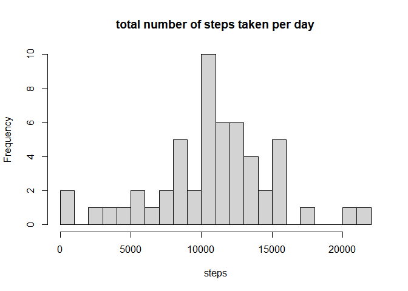
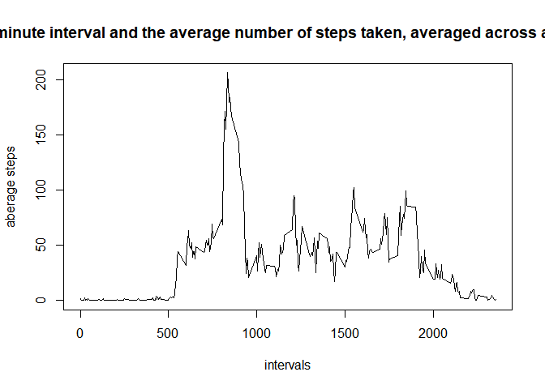
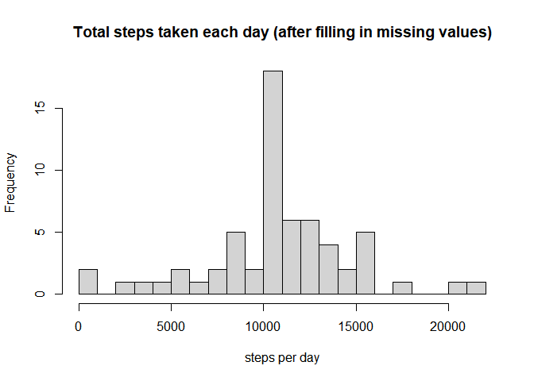
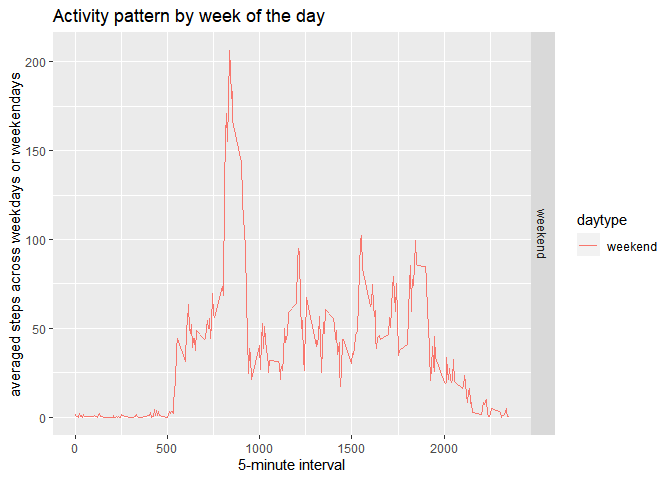

## Loading and preprocessing the data


```r
url <- "https://d396qusza40orc.cloudfront.net/repdata%2Fdata%2Factivity.zip"
zip_file <- ".\\repdata_data_activity.zip"
if(!file.exists("zip_file")){
  download.file(url,destfile = zip_file, mode = 'wb')
file_name <- ".\\activity.csv"
if(!file.exists(file_name)){
  unzip(zipfile = zip_file,exdir = getwd())
}

data1 <- read.csv(file_name, header = TRUE)
data1$date <- as.Date(x=data1$date, "%Y-%m-%d")
data2 <- data1
}
```

## What is mean total number of steps taken per day?

```r
## first, we need to eliminate all the na values
data1 <- na.omit(data1)
totalStep <- aggregate(steps~date,data=data1, FUN=sum)
hist(totalStep$steps,main="total number of steps taken per day",
     xlab="steps",breaks=25)
```

<!-- -->
mean steps per day

```r
print(mean(totalStep$steps))
```

```
## [1] 10766.19
```
median steps per day

```r
print(median(totalStep$steps))
```

```
## [1] 10765
```


## What is the average daily activity pattern?

```r
averageSteps<- aggregate(steps~interval,data=data1, FUN=mean)
plot(x=averageSteps$interval ,y=averageSteps$steps,type="l",
     xlab="intervals",ylab="aberage steps",main=" 5-minute interval and the average number of steps taken, averaged across all days")
```

<!-- -->
maximum numbers of steps

```r
print(averageSteps$interval[which.max(averageSteps$steps)])
```

```
## [1] 835
```


## Imputing missing values
the total number of missing values is

```r
sum(is.na(data2$steps))
```

```
## [1] 2304
```


```r
averageSteps<- aggregate(steps~interval,data=data2, FUN=mean,na.rm=TRUE)
x1 <- na.omit(subset(averageSteps, interval == data2$interval[is.na(data2$steps)]))
data_fillin <- data2
data_fillin[is.na(data2$steps),1] <- x1[,2]
stepsNoNA <-aggregate(steps ~ date, data = data_fillin, FUN = sum)
hist(stepsNoNA$steps,
     main = "Total steps taken each day (after filling in missing values)",
     xlab = "steps per day",breaks = 25)
```

<!-- -->

```r
meanSteps <- mean(stepsNoNA$steps)
meanSteps
```

```
## [1] 10766.19
```

```r
medianSteps <- median(stepsNoNA$steps)
medianSteps
```

```
## [1] 10766.19
```


## Are there differences in activity patterns between weekdays and weekends?


```r
weekdaysValue <-c('Monday', 'Tuesday', 'Wednesday', 'Thursday', 'Friday')
dateType <- ifelse(
  weekdays(data_fillin$date) %in% weekdaysValue,
           'weekdays',
           'weekend')
data_fillin$daytype <- factor(x = dateType)
```


```r
averageStep <- aggregate(steps~interval+daytype,data=data_fillin,FUN=mean)

library(ggplot2)
ggplot(averageStep,aes(interval,steps,col=daytype))+
  geom_line()+
  facet_grid(rows=vars(daytype))+
  xlab('5-minute interval')+
  ylab('averaged steps across weekdays or weekendays')+
  ggtitle('Activity pattern by week of the day')
```

<!-- -->

